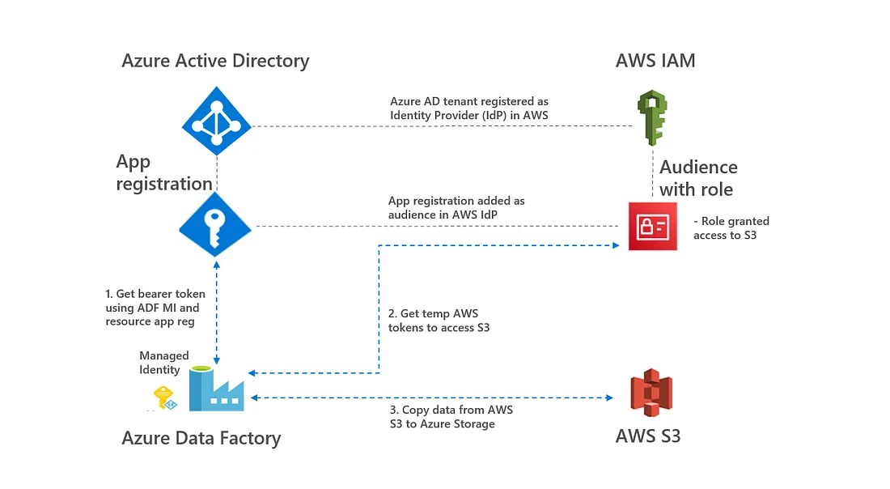
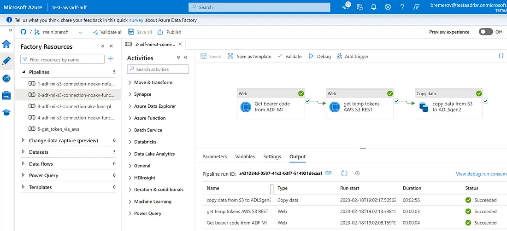

# data-factory-managed-identity-connection-aws-s3
Repository to setup secret-less access from Azure Data Factory to AWS S3, see also architecture below.

Documenation can be found in this [link](https://rebremer.medium.com/9353f3309efb). In short:

- Setup Azure tenant as Identity Provider in AWS, following this excellent [guide](https://blog.identitydigest.com/azuread-access-aws/) by Uday Hegde.
- Deploy ADF pipeline using ARM template in test-awsadf-adf folder and run pipeline.

Succesfull run can be found below.

